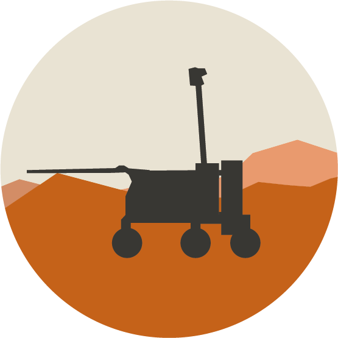
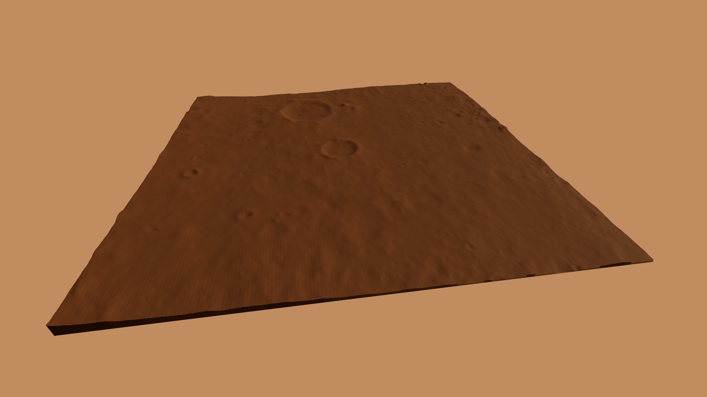
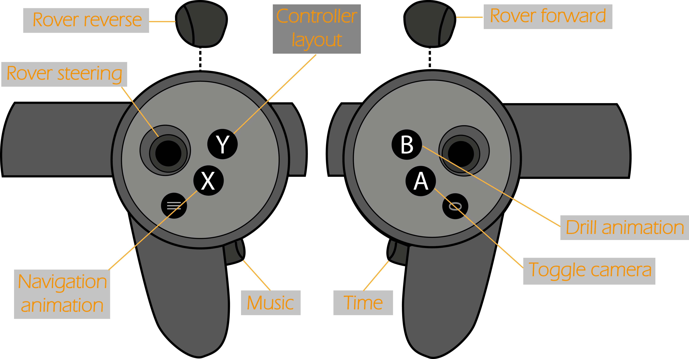

# ExoMars: A Virtual Journey 

I created an immersive Virtual Reality environment as a method of science communication for ESA's ExoMars 2022 mission. The design of the application is game-like, but with a focus on scientific accuracy and realism.
This repository includes C# scripts and shaders for Unity, and some other assets. Everything else was left out due to file size and copyright.

## The environment
The landscape has been created from a heightmap of the proposed landing site of the mission. This is combined with realistic ground textures, a controllable day-night cycle with realistic atmospheric effects, a skybox that changes accordingly, and a distribution of rocks on the ground.

## Conrolling the Rover
The application includes models of the landing platform and the Mars Rover. The user can take control of the Rover and explore the surface of Mars. The Rover has different animations for movement and drilling, and leaves tracks in the sand as it moves.

## Music
Less realistic, but more artistic, the application plays music in the background. I have not implemented realistic atmospheric sounds due to time restraints. The music was created by me.

